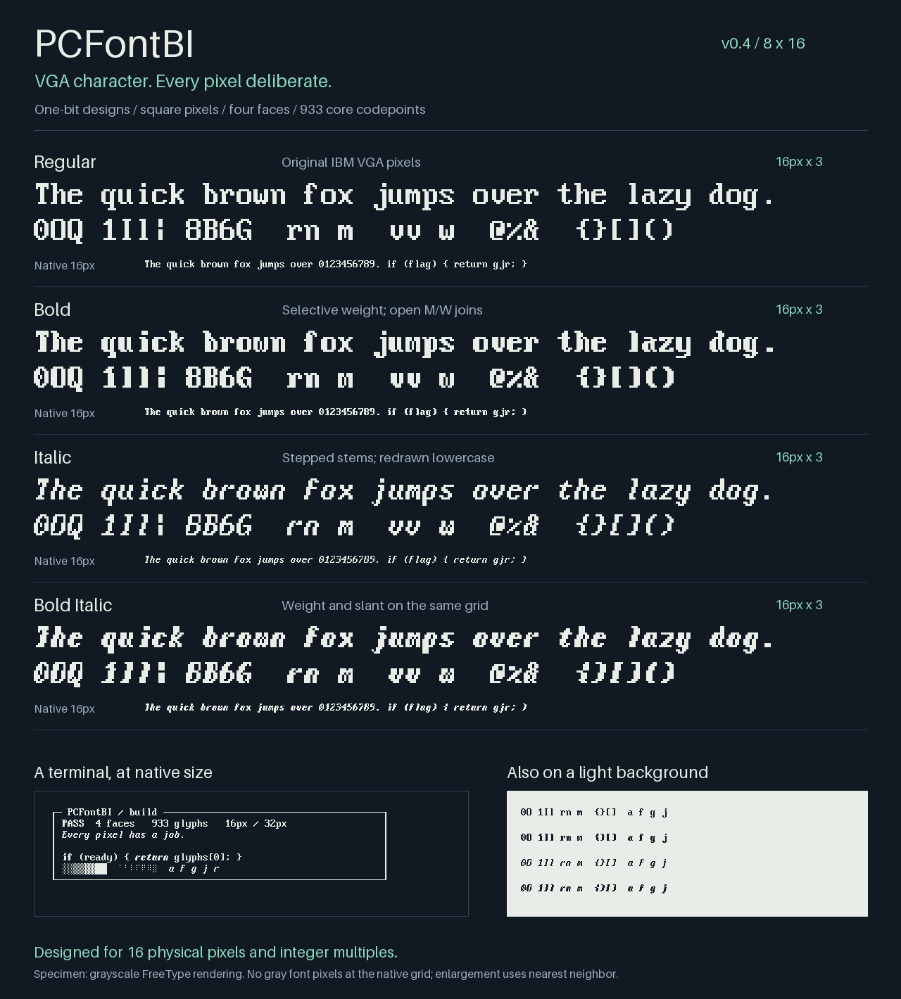
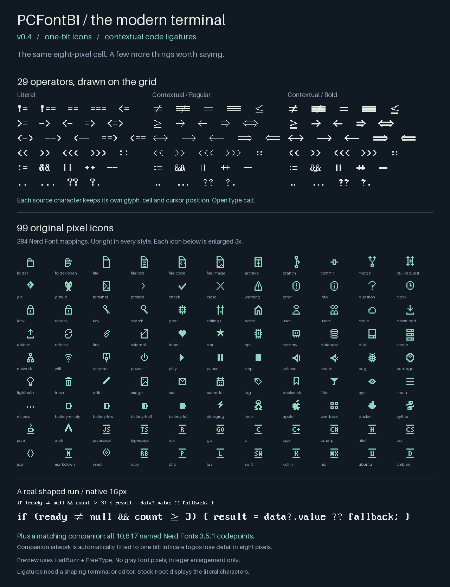

# PCFontBI

**VGA character. Every pixel deliberate.** A four-face 8×16 terminal family: Regular, Bold, Italic and Bold Italic. v0.4.0 adds pixel icons and programming ligatures to the native one-bit grid.



## The design

| Face | Construction |
| --- | --- |
| Regular | Original IBM VGA 8×16 ROM pixels, unchanged. |
| Bold | Selected whole-pixel weight additions, protected counters, opened M/W joins. |
| Italic | Explicit ASCII bitmap masters, a two-pixel staircase, redrawn lowercase and a single-storey a. |
| Bold Italic | Weight applied to the italic bitmap, with separate M/W corrections. |

The 95 printable ASCII characters in each styled face have editable masters in [design/strikes.json](design/strikes.json). They were seeded from the ROM, then curated; the italic lowercase was redrawn. Other CP437 characters use conservative fallback styling and are not individually authored. Regular remains the fidelity reference.

Every face has the same **8×16 cell** and **933 Unicode codepoints**: CP437, complete Block Elements and Braille ranges, four Powerline separators, punctuation aliases and common Nerd Font icons. Box drawing, blocks, Braille and Powerline stay identical across styles. Letters and digits keep a one-pixel right gutter. The original full-width VGA symbols retain their width.

The family comes in two forms:

- **TTF:** square, axis-aligned outlines around the pixel shapes; easy to install in modern terminals.
- **BDF:** genuine one-bit 16px bitmap strikes; useful for inspection and bitmap-capable applications.

The old aspect-compressed and antialiased designs remain in Git history. v0.3 uses the new **PCFontBI** family name and filenames, so it can coexist with the earlier IBM VGA 8x16 TUI family. The cell is now 8px wide at a 16px em, up from 6.625px; this deliberately trades some horizontal density for exact pixels.

## Icons and programming ligatures



**99 original bitmap icons cover 384 Nerd Font mappings** in each core face: files, folders, Git, status, hardware and language symbols. One mapping overlaps the original VGA heart; its original pixels take priority. Icons stay upright and unchanged in all styles.

The separate **PCFontBI Symbols** companion supplies the full **10,617 distinct named codepoints from Nerd Fonts 3.5.1**. Its artwork is automatically fitted to a one-bit 8×16 grid, with four matching styles in one `.ttc` file. It is not individually hand-drawn: dense logos necessarily lose detail. Install both parts for full coverage. This is an independent Nerd Font-compatible package, not an official patched Nerd Fonts release.

**29 programming sequences** use OpenType `calt` contextual alternates. Every input character keeps one glyph, its cluster and one cell of advance; joined drawings do not change the text or collapse cursor positions. Disable `calt` to see the literal operators. [Feature notes](docs/features.md) list the supported sequences and installation details.

Stock **Foot does not support programming ligatures across characters**. It displays the original operators and supports the icons through Fontconfig fallback. Ligatures work in shaping-capable applications such as Kitty and Ghostty when `calt` is enabled. In Ghostty, `font-feature = -calt` disables them; Kitty also offers `font_features` and `disable_ligatures` controls. These application paths have not been tested on the user's display.

BDF contains the core icons but cannot carry OpenType shaping. Use TTF for the ligatures; the full symbol repertoire is in the TTC companion.

## Install

From the repository root:

```sh
./install.sh
fc-match PCFontBI
```

This installs the four core TTFs, the four-style Symbols TTC and a per-user Fontconfig fallback rule for PCFontBI. It does not change terminal settings or install the BDFs. Built fonts are in [fonts/](fonts/).

### Foot

Use a **16 physical-pixel em**, or an integer multiple such as 32px. Start with this font-only configuration fragment:

```ini
font=PCFontBI:pixelsize=16:antialias=false:hinting=false
font-bold=PCFontBI:style=Bold:pixelsize=16:antialias=false:hinting=false
font-italic=PCFontBI:style=Italic:pixelsize=16:antialias=false:hinting=false
font-bold-italic=PCFontBI:style=Bold Italic:pixelsize=16:antialias=false:hinting=false
```

`pixelsize` avoids point-to-pixel DPI conversion. Foot's DPI/scaling settings and compositor scaling still matter: the final raster should land on the physical display grid. With `dpi-aware=yes`, Foot documents that an explicit `pixelsize` is used as-is; other scaling paths can multiply it. Inspect a screenshot at 100% rather than assuming the requested size is the final size.

The per-font `antialias=false` requests whole-pixel rendering; `hinting=false` avoids moving the authored grid. This also avoids deliberately applying RGB/WRGB smoothing to these glyphs in renderers that honor the setting. These are settings to test in your Foot build, not a claim that its custom WRGB path has been verified.

See the [Foot configuration manual](https://manpages.debian.org/trixie/foot/foot.ini.5.en.html) and [Fontconfig properties](https://fontconfig.pages.freedesktop.org/fontconfig/fontconfig-user.html).

### Size limits

The native design is 16px, with clean integer enlargement to 32px, 48px, and so on at an integer pixel origin. A 20px or 24px raster does not map each design pixel to a whole screen pixel: antialiasing can soften it, while monochrome rounding can distort it. A future 20px strike should be designed at 20px. The TTFs deliberately contain no autohinting or size-specific hint programs.

## Build and review

```sh
python -m pip install -r requirements.txt
make all
```

This builds four core TTFs, four core BDFs and the Symbols TTC, runs the tests, and produces the [family specimen](docs/specimen.png), [feature specimen](docs/features.png) and [glyph atlas](docs/glyph-atlas.png). Open images at 100% to avoid viewer resampling.

The tests check **all 933 core codepoints in every face** through grayscale FreeType/Pillow rendering:

- No intermediate gray pixels at 16px, and exact doubled rasters at 32px.
- Pixel-for-pixel ROM fidelity in Regular and exact ASCII-master reproduction in the styles.
- TTF/BDF raster parity, cell bounds, grid alignment, spacing and style metadata.
- Structural glyph identity, representative counter preservation and distinct confusable characters.
- Real HarfBuzz shaping of all 29 sequences in all styles, feature-off behavior, complete operator-run boundaries and exact raster output.
- Every companion codepoint at 16px and 32px, nonblank coverage (except the intentional `nf-cod-blank`), style identity and Fontconfig fallback.

In the checked native-size phrase, Bold adds about 15.6% ink over Regular; Bold Italic adds about 18.6% over Italic. These are weight measurements, not readability scores. The specimens were visually inspected on dark and light backgrounds; the target OLED and custom Foot renderer still need local review.

[Design notes](design/README.md) explain the choices. [ROADMAP.md](ROADMAP.md) tracks remaining work.

## Source and license

The base raster is VileR's VGA8.F16 dump of IBM's VGA 8×16 character set. Credit and the existing **CC BY-SA 4.0** terms are preserved in [ATTRIBUTION.md](ATTRIBUTION.md) and [LICENSE](LICENSE). PCFontBI is an independent derivative, not an IBM product.

The Symbols companion retains its source icon-set licenses separately; see [its provenance](upstream/nerd-fonts/README.md). It is not relicensed under the core family’s CC BY-SA terms.
